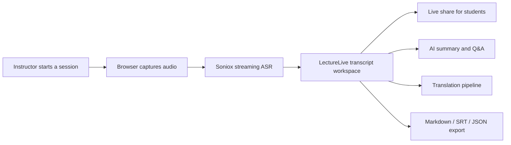

<div align="center">


# LectureLive

**Real-time classroom transcription, translation, and AI note-taking**

Turn every lecture into a searchable learning session with live subtitles, multilingual translation, AI summaries, and export-ready study materials.

[](https://nextjs.org/)
[](https://react.dev/)
[](https://www.typescriptlang.org/)
[](https://tailwindcss.com/)
[](https://socket.io/)
[](https://www.prisma.io/)
[](https://www.docker.com/)
[](LICENSE)

[**English**](README.md) | [**中文**](README.zh-CN.md)

[Quick Start](#quick-start) | [Architecture](#architecture) | [Repository Map](#repository-map) | [Scripts](#scripts-reference) | [Configuration](#configuration--security)

</div>

---

## Why LectureLive

LectureLive is a full-stack web application for live teaching scenarios. It combines browser-based speech recognition, real-time collaboration, multilingual translation, and LLM-powered understanding so instructors can run a session once and reuse it as notes, subtitles, summaries, and searchable records.

## At a Glance

<table>
  <tr>
    <td width="50%">
      <strong>Live transcription</strong><br />
      Stream speech to text directly in the browser with Soniox for low-latency classroom use.
    </td>
    <td width="50%">
      <strong>Shared live sessions</strong><br />
      Students can follow the same transcript, summary, and keywords in real time through a share link.
    </td>
  </tr>
  <tr>
    <td width="50%">
      <strong>AI learning aids</strong><br />
      Plug in Claude, GPT, DeepSeek, or any OpenAI-compatible model for summaries, reports, and Q&amp;A.
    </td>
    <td width="50%">
      <strong>Multilingual translation</strong><br />
      Use cloud translation or run a local ONNX pipeline in the browser with WebGPU acceleration.
    </td>
  </tr>
  <tr>
    <td width="50%">
      <strong>Recording and playback</strong><br />
      Keep audio aligned with transcript data so sessions can be reviewed and replayed later.
    </td>
    <td width="50%">
      <strong>Self-hosted operations</strong><br />
      Deploy with Docker Compose, MySQL, Redis, and Cloudreve for a fully owned stack.
    </td>
  </tr>
</table>

## Session Flow



## Architecture

```text
┌─────────────────────────────────────────────────────────────┐
│                          Browser                            │
│  ┌──────────┐  ┌──────────┐  ┌───────────┐  ┌────────────┐ │
│  │ Next.js  │  │ Soniox   │  │ Socket.IO │  │ Local ONNX │ │
│  │ React UI │  │ ASR SDK  │  │ Client    │  │ Translation│ │
│  └────┬─────┘  └────┬─────┘  └─────┬─────┘  └─────┬──────┘ │
└───────┼──────────────┼──────────────┼──────────────┼────────┘
        │              │              │              │
        ▼              ▼              ▼              ▼
┌──────────────┐ ┌───────────┐ ┌───────────────┐ ┌──────────────┐
│  Next.js API │ │ Soniox    │ │  WebSocket    │ │ LLM Gateway  │
│  (port 3000) │ │ Cloud ASR │ │  (port 3001)  │ │ multi-vendor │
└──────┬───────┘ └───────────┘ └───────┬───────┘ └──────┬───────┘
       │                               │                │
       ▼                               ▼                ▼
┌────────────┐                  ┌─────────┐      ┌─────────────┐
│  MySQL 8.4 │                  │ Redis 7 │      │ Cloudreve   │
│  (Prisma)  │                  │         │      │ file store  │
└────────────┘                  └─────────┘      └─────────────┘
```

## Tech Stack

| Layer | Technology |
| :---- | :--------- |
| Frontend | Next.js 15 (App Router) + React 18 + TypeScript |
| Styling | Tailwind CSS 3.4 with a custom cream / charcoal / rust palette |
| State | Zustand 5 |
| Real-time | Socket.IO 4.8 with an independent WebSocket server |
| Database | MySQL 8.4 + Prisma ORM 5 |
| Cache | Redis 7 for token blacklist and rate limiting |
| ASR | Soniox browser-direct streaming |
| Translation | Soniox Cloud + Helsinki-NLP ONNX via Transformers.js |
| LLM | Multi-vendor gateway for Claude, GPT, DeepSeek, and custom providers |
| Storage | Cloudreve |
| Deployment | Docker Compose + Nginx |

## Quick Start

### Prerequisites

- Node.js 20+
- MySQL 8.x
- Redis 7.x
- npm or pnpm

### Local Development

```bash
# 1. Clone the repository
git clone https://github.com/PLus123456/lecture-live.git
cd lecture-live

# 2. Install dependencies
npm install

# 3. Configure environment variables
cp .env.example .env.local
# At minimum set DATABASE_URL, REDIS_URL, JWT_SECRET

# 4. Prepare the database
npm run db:ensure

# 5. Start both development servers
npm run dev
npm run dev:ws
```

> `npm run dev` serves the Next.js app at `http://localhost:3000`, and `npm run dev:ws` starts the Socket.IO server at `ws://localhost:3001`.

### Docker Deployment

```bash
# 1. Configure environment variables
cp .env.example .env.local
# Set DB_PASSWORD, MYSQL_ROOT_PASSWORD, REDIS_PASSWORD, JWT_SECRET, ENCRYPTION_KEY

# 2. Launch the full stack
docker-compose up -d

# 3. Verify health
curl http://localhost:3000/api/health
```

The Docker stack includes the app server, WebSocket service, MySQL 8.4, Redis 7, and Cloudreve.

## Repository Map

```text
lecture-live/
├── src/
│   ├── app/                # Next.js App Router pages and API routes
│   │   ├── (auth)/         # Login and registration
│   │   ├── (dashboard)/    # Home, folders, settings, admin
│   │   ├── session/        # Recording, live view, playback
│   │   ├── library/        # Shared sessions
│   │   └── api/            # REST API endpoints
│   ├── components/         # React UI and mobile-specific components
│   ├── hooks/              # Custom hooks for ASR, auth, live share, translation
│   ├── lib/                # Core domain logic, services, security, export, billing
│   ├── stores/             # Zustand stores
│   └── types/              # Shared TypeScript types
├── prisma/
│   └── schema.prisma       # Database schema
├── server/
│   └── websocket.ts        # Independent Socket.IO server
├── scripts/                # Database, billing, and maintenance scripts
├── tests/                  # Test assets and shared testing support
├── e2e/                    # Playwright end-to-end tests
├── public/                 # App icons and static assets
├── docker-compose.yml
├── Dockerfile
└── deploy/                 # Deployment shims and runtime helpers
```

## Configuration & Security

See [`.env.example`](.env.example) for the full environment variable list. The most important values are:

| Variable | Purpose |
| :------- | :------ |
| `DATABASE_URL` | MySQL connection string |
| `REDIS_URL` | Redis connection string |
| `JWT_SECRET` | JWT signing secret, minimum 32 characters |
| `ENCRYPTION_KEY` | Encryption key used for stored provider credentials |
| `SONIOX_API_KEY` | Soniox API key fallback |
| `NEXT_PUBLIC_APP_URL` | Public web URL, default `http://localhost:3000` |
| `NEXT_PUBLIC_WS_URL` | Public WebSocket URL, default `http://localhost:3001` |

> LLM provider keys and Soniox credentials are best managed from the admin dashboard, where they can be stored encrypted in the database. Environment variables are mainly a fallback path.

### Cloudreve OAuth (v4)

LectureLive uses the Cloudreve v4 OAuth authorization code flow with PKCE for storage access.

#### Required Cloudreve app settings

- `Redirect URI` must exactly match LectureLive's callback URL.
- Local development: `http://localhost:3000/api/admin/cloudreve/callback`
- Production: `https://your-domain/api/admin/cloudreve/callback`
- Recommended scopes: `offline_access Files.Read Files.Write`

#### Important notes

- The `redirect_uri` sent to Cloudreve must be identical to the URI registered in the Cloudreve admin panel, including protocol, host, port, and path.
- `offline_access` is required if you want Cloudreve to return a `refresh_token`.
- When you click `Cloudreve Authorize` in the admin panel, LectureLive now saves the current Cloudreve URL, Client ID, and Client Secret before redirecting to Cloudreve.
- OAuth configuration resolution order is: environment variables first, then saved admin settings.

## Scripts Reference

| Command | Description |
| :------ | :---------- |
| `npm run dev` | Start the Next.js development server |
| `npm run dev:ws` | Start the Socket.IO development server |
| `npm run build` | Build the production Next.js app |
| `npm run build:ws` | Bundle the WebSocket server for production |
| `npm run start` | Start the production Next.js app |
| `npm run start:ws` | Start the WebSocket server in production mode |
| `npm run lint` | Run ESLint |
| `npm run type-check` | Run TypeScript type checking |
| `npm run test` | Run Vitest unit tests |
| `npm run test:coverage` | Run unit tests with coverage |
| `npm run test:e2e` | Run Playwright E2E tests |
| `npm run db:ensure` | Ensure the database exists and schema is synced |
| `npm run db:migrate` | Run Prisma development migrations |
| `npm run db:migrate:deploy` | Apply production migrations |
| `npm run db:studio` | Open Prisma Studio |
| `npm run billing:reset-quotas` | Reset monthly transcription quotas |
| `npm run billing:reconcile` | Reconcile transcription usage |
| `npm run billing:maintenance` | Run billing maintenance tasks |
| `npm run security:reencrypt-llm-keys` | Re-encrypt stored LLM provider keys |

## Contributing

Contributions are welcome through issues and pull requests.

1. Fork the repository.
2. Create a feature branch with a descriptive name.
3. Make changes with tests where appropriate.
4. Open a pull request that explains the motivation and scope.

## License

This project is licensed under the GNU General Public License v3.0. See [LICENSE](LICENSE) for details.

## Acknowledgments

- [Soniox](https://soniox.com/) for real-time speech recognition
- [Transformers.js](https://huggingface.co/docs/transformers.js) for in-browser machine learning inference
- [Prisma](https://www.prisma.io/) for type-safe database access
- [Socket.IO](https://socket.io/) for real-time bidirectional communication
- [Cloudreve](https://cloudreve.org/) for self-hosted file storage

---

<div align="center">

If LectureLive helps your learning workflow, a Star is always appreciated.

</div>
