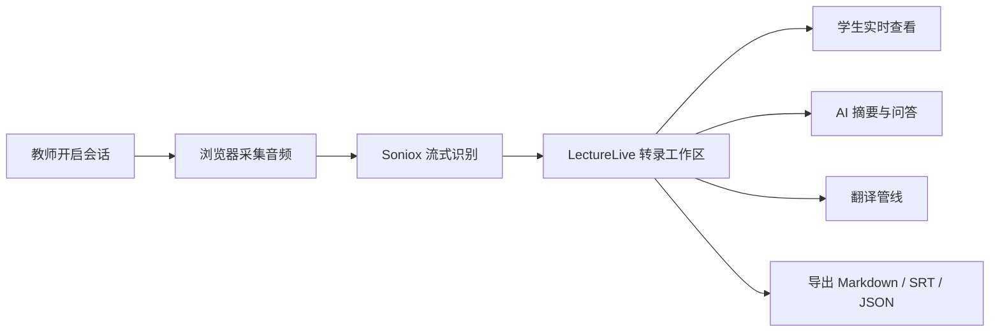

<div align="center">


# LectureLive

**面向课堂场景的实时转录、翻译与 AI 笔记平台**

将每一堂课变成可搜索、可分享、可导出的学习记录，覆盖实时字幕、多语言翻译、AI 摘要与课后回放。

[](https://nextjs.org/)
[](https://react.dev/)
[](https://www.typescriptlang.org/)
[](https://tailwindcss.com/)
[](https://socket.io/)
[](https://www.prisma.io/)
[](https://www.docker.com/)
[](LICENSE)

[**English**](README.md) | [**中文**](README.zh-CN.md)

[快速开始](#快速开始) | [系统架构](#系统架构) | [仓库结构](#仓库结构) | [常用命令](#常用命令) | [配置与安全](#配置与安全)

</div>

---

## 项目简介

LectureLive 是一个面向直播授课与课堂记录的全栈 Web 应用。它把浏览器端语音识别、实时协作、多语言翻译和 LLM 智能理解串成一条完整链路，让教师只需开启一次课程，会后就能得到摘要、字幕、关键词和结构化导出内容。

## 一眼看懂

<table>
  <tr>
    <td width="50%">
      <strong>实时语音转录</strong><br />
      浏览器直连 Soniox 进行低延迟流式识别，适合课堂和讲座场景。
    </td>
    <td width="50%">
      <strong>共享直播会话</strong><br />
      学生通过分享链接即可同步查看同一份转录、摘要与关键词。
    </td>
  </tr>
  <tr>
    <td width="50%">
      <strong>AI 学习辅助</strong><br />
      可接入 Claude、GPT、DeepSeek 或任意 OpenAI 兼容模型，生成摘要、报告与问答结果。
    </td>
    <td width="50%">
      <strong>多语言翻译</strong><br />
      既支持云端翻译，也支持浏览器内使用 WebGPU 加速的本地 ONNX 翻译。
    </td>
  </tr>
  <tr>
    <td width="50%">
      <strong>录音与回放</strong><br />
      音频与转录数据保持关联，便于课后复盘、纠错和二次整理。
    </td>
    <td width="50%">
      <strong>自托管部署</strong><br />
      通过 Docker Compose 组合 MySQL、Redis、Cloudreve 与应用服务，方便私有化落地。
    </td>
  </tr>
</table>

## 会话流程



## 系统架构

```text
┌─────────────────────────────────────────────────────────────┐
│                           浏览器                            │
│  ┌──────────┐  ┌──────────┐  ┌───────────┐  ┌────────────┐ │
│  │ Next.js  │  │ Soniox   │  │ Socket.IO │  │ 本地 ONNX  │ │
│  │ React UI │  │ ASR SDK  │  │ Client    │  │ 翻译管线   │ │
│  └────┬─────┘  └────┬─────┘  └─────┬─────┘  └─────┬──────┘ │
└───────┼──────────────┼──────────────┼──────────────┼────────┘
        │              │              │              │
        ▼              ▼              ▼              ▼
┌──────────────┐ ┌───────────┐ ┌───────────────┐ ┌──────────────┐
│  Next.js API │ │ Soniox    │ │  WebSocket    │ │  LLM 网关    │
│  (端口 3000) │ │ 云端 ASR  │ │  (端口 3001)  │ │ 多供应商接入 │
└──────┬───────┘ └───────────┘ └───────┬───────┘ └──────┬───────┘
       │                               │                │
       ▼                               ▼                ▼
┌────────────┐                  ┌─────────┐      ┌─────────────┐
│  MySQL 8.4 │                  │ Redis 7 │      │ Cloudreve   │
│  (Prisma)  │                  │         │      │ 文件存储    │
└────────────┘                  └─────────┘      └─────────────┘
```

## 技术栈

| 层级 | 技术方案 |
| :--- | :------- |
| 前端 | Next.js 15 (App Router) + React 18 + TypeScript |
| 样式 | Tailwind CSS 3.4，自定义奶油 / 炭灰 / 铁锈色主题 |
| 状态管理 | Zustand 5 |
| 实时通信 | Socket.IO 4.8，独立 WebSocket 服务 |
| 数据库 | MySQL 8.4 + Prisma ORM 5 |
| 缓存 | Redis 7，用于令牌黑名单与速率限制 |
| 语音识别 | Soniox 浏览器直连流式识别 |
| 翻译 | Soniox Cloud + Helsinki-NLP ONNX（Transformers.js） |
| LLM | 多供应商网关，支持 Claude、GPT、DeepSeek 与自定义模型 |
| 文件存储 | Cloudreve |
| 部署 | Docker Compose + Nginx |

## 快速开始

### 环境要求

- Node.js 20+
- MySQL 8.x
- Redis 7.x
- npm 或 pnpm

### 本地开发

```bash
# 1. 克隆仓库
git clone https://github.com/PLus123456/lecture-live.git
cd lecture-live

# 2. 安装依赖
npm install

# 3. 配置环境变量
cp .env.example .env.local
# 至少需要设置 DATABASE_URL、REDIS_URL、JWT_SECRET

# 4. 准备数据库
npm run db:ensure

# 5. 启动两个开发服务
npm run dev
npm run dev:ws
```

> `npm run dev` 启动 Next.js 应用，地址为 `http://localhost:3000`；`npm run dev:ws` 启动 Socket.IO 服务，地址为 `ws://localhost:3001`。

### Docker 部署

```bash
# 1. 配置环境变量
cp .env.example .env.local
# 设置 DB_PASSWORD、MYSQL_ROOT_PASSWORD、REDIS_PASSWORD、JWT_SECRET、ENCRYPTION_KEY

# 2. 启动整套服务
docker-compose up -d

# 3. 健康检查
curl http://localhost:3000/api/health
```

Docker 栈包含应用服务、WebSocket 服务、MySQL 8.4、Redis 7 与 Cloudreve。

## 仓库结构

```text
lecture-live/
├── src/
│   ├── app/                # Next.js App Router 页面与 API 路由
│   │   ├── (auth)/         # 登录与注册
│   │   ├── (dashboard)/    # 首页、文件夹、设置、管理后台
│   │   ├── session/        # 录制、直播查看、回放
│   │   ├── library/        # 共享会话
│   │   └── api/            # REST API 接口
│   ├── components/         # React UI 与移动端组件
│   ├── hooks/              # ASR、认证、实时分享、翻译等自定义 Hooks
│   ├── lib/                # 核心业务逻辑、服务、鉴权、导出、计费
│   ├── stores/             # Zustand 状态仓库
│   └── types/              # 共享 TypeScript 类型
├── prisma/
│   └── schema.prisma       # 数据库模型
├── server/
│   └── websocket.ts        # 独立 Socket.IO 服务
├── scripts/                # 数据库、计费与维护脚本
├── tests/                  # 测试资源与公共测试支持
├── e2e/                    # Playwright 端到端测试
├── public/                 # 图标与静态资源
├── docker-compose.yml
├── Dockerfile
└── deploy/                 # 部署辅助文件与运行时兼容层
```

## 配置与安全

完整环境变量请查看 [`.env.example`](.env.example)。其中最关键的是：

| 变量 | 作用 |
| :--- | :--- |
| `DATABASE_URL` | MySQL 连接字符串 |
| `REDIS_URL` | Redis 连接字符串 |
| `JWT_SECRET` | JWT 签名密钥，至少 32 个字符 |
| `ENCRYPTION_KEY` | 用于加密存储供应商凭证的密钥 |
| `SONIOX_API_KEY` | Soniox API Key 后备配置 |
| `NEXT_PUBLIC_APP_URL` | 对外 Web 地址，默认 `http://localhost:3000` |
| `NEXT_PUBLIC_WS_URL` | 对外 WebSocket 地址，默认 `http://localhost:3001` |

> LLM 供应商密钥与 Soniox 凭证更推荐通过管理后台录入，并以加密形式保存在数据库中。环境变量主要作为后备方案存在。

### Cloudreve OAuth（v4）

LectureLive 接入 Cloudreve 存储时，使用的是 Cloudreve v4 的 OAuth 授权码流程，并启用了 PKCE。

#### Cloudreve 侧必须填写的配置

- `Redirect URI` 必须与 LectureLive 的回调地址完全一致。
- 本地开发：`http://localhost:3000/api/admin/cloudreve/callback`
- 生产环境：`https://你的域名/api/admin/cloudreve/callback`
- 推荐 scopes：`openid offline_access Files.Write`

#### 关键说明

- 发送给 Cloudreve 的 `redirect_uri` 必须与 Cloudreve 管理后台登记的地址完全一致，协议、域名、端口、路径都不能有差异。
- Cloudreve OAuth 授权时必须显式包含 `openid`。
- 如果希望 Cloudreve 返回 `refresh_token`，scope 里必须包含 `offline_access`。
- Cloudreve 用 `Files.Write` 表示文件读写权限；除非你的 Cloudreve 实例明确支持，否则不要同时请求 `Files.Read Files.Write`。
- 现在点击管理后台的 `Cloudreve 授权` 按钮前，LectureLive 会先保存当前填写的 Cloudreve 地址、Client ID 和 Client Secret，再跳转到 Cloudreve。
- OAuth 配置读取优先级为：环境变量优先，其次才是管理后台里保存的设置。

## 常用命令

| 命令 | 说明 |
| :--- | :--- |
| `npm run dev` | 启动 Next.js 开发服务器 |
| `npm run dev:ws` | 启动 Socket.IO 开发服务器 |
| `npm run build` | 构建生产环境 Next.js 应用 |
| `npm run build:ws` | 打包生产环境 WebSocket 服务 |
| `npm run start` | 启动生产环境 Next.js 应用 |
| `npm run start:ws` | 启动生产环境 WebSocket 服务 |
| `npm run lint` | 执行 ESLint |
| `npm run type-check` | 执行 TypeScript 类型检查 |
| `npm run test` | 运行 Vitest 单元测试 |
| `npm run test:coverage` | 运行带覆盖率的单元测试 |
| `npm run test:e2e` | 运行 Playwright 端到端测试 |
| `npm run db:ensure` | 确保数据库存在并同步结构 |
| `npm run db:migrate` | 执行 Prisma 开发迁移 |
| `npm run db:migrate:deploy` | 执行生产迁移 |
| `npm run db:studio` | 打开 Prisma Studio |
| `npm run billing:reset-quotas` | 重置月度转录配额 |
| `npm run billing:reconcile` | 对账转录使用量 |
| `npm run billing:maintenance` | 执行计费维护任务 |
| `npm run security:reencrypt-llm-keys` | 重新加密已存储的 LLM 密钥 |

## 参与贡献

欢迎通过 Issue 和 Pull Request 一起完善项目。

1. Fork 本仓库。
2. 创建语义清晰的功能分支。
3. 完成功能并补充必要测试。
4. 提交 Pull Request，说明动机与影响范围。

## 开源协议

本项目基于 GNU General Public License v3.0 开源，详见 [LICENSE](LICENSE)。

## 致谢

- [Soniox](https://soniox.com/) 提供实时语音识别能力
- [Transformers.js](https://huggingface.co/docs/transformers.js) 提供浏览器内机器学习推理能力
- [Prisma](https://www.prisma.io/) 提供类型安全的数据库访问体验
- [Socket.IO](https://socket.io/) 提供实时双向通信能力
- [Cloudreve](https://cloudreve.org/) 提供自托管文件存储能力

---

<div align="center">

如果 LectureLive 对你的学习流程有帮助，欢迎给项目一个 Star。

</div>
